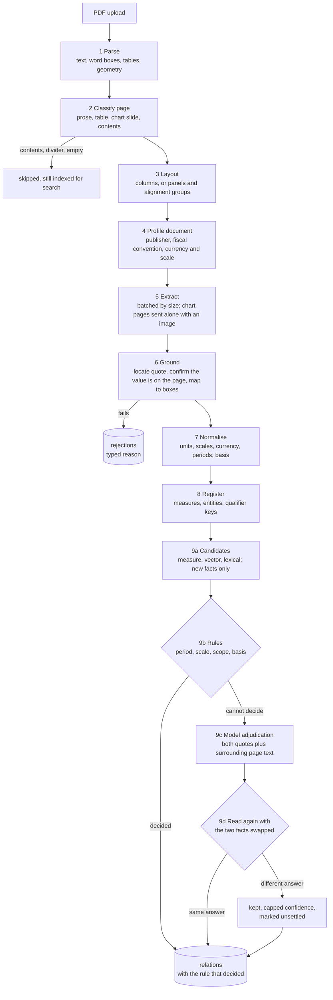

# Technical documentation

Living record of the stack, architecture, data model and pipeline. Written as each
milestone landed rather than reconstructed at the end.

- [Stack](#stack)
- [Repository layout](#repository-layout)
- [The four ideas the project rests on](#the-four-ideas-the-project-rests-on)
- [Core primitives](#core-primitives)
- [Data model](#data-model)
- [Pipeline](#pipeline)
- [Prompt design](#prompt-design)
- [Performance](#performance)
- [API](#api)
- [Interface](#interface)
- [Testing](#testing)
- [Configuration](#configuration)

## Stack

| Layer | Choice | Why |
| --- | --- | --- |
| PDF parsing | PyMuPDF | Word-level bounding boxes, `search_for` for evidence highlighting, and table detection. The bounding boxes are what let a fact point at a rectangle on a page rather than just a page number. |
| API | FastAPI + Uvicorn | Async request handling, automatic OpenAPI, and native support for the streaming progress endpoint. |
| Storage | SQLite (WAL) + FTS5 | The whole knowledge layer is one portable file. No server to run, and it can be committed as an evaluation snapshot. FTS5 provides lexical retrieval without a second system. |
| ORM | SQLAlchemy 2.0 | Typed models, cascade behaviour, and raw SQL where the query is better expressed that way. |
| Embeddings | fastembed (ONNX, `bge-small-en-v1.5`, 384 dims) | Runs locally on CPU. Candidate generation touches every new fact against the corpus, so it has to be free and offline. |
| Language model | Gemini, any OpenAI-compatible endpoint, or Ollama behind one interface | Used for extraction, profiling, registry linking and adjudication only. The provider is configuration, not architecture. |
| Frontend | Vite + React + TypeScript | Fast dev loop, no framework-level opinions to fight. |
| Page rendering | PyMuPDF, server-side | See [Interface](#interface) for why this beat pdf.js here. |

### Things deliberately not used

**A graph database.** The brief says a graph database is not the solution, and it is right:
the interesting part is deciding whether two facts relate, not storing the edge afterwards.
Relations are a table with two foreign keys. Every query the interface makes is a filter or
a two-hop join, which SQLite indexes handle without a second system to run and explain.

**A vector index (FAISS, sqlite-vec, pgvector).** Vectors are stored as raw float32 blobs
and searched with a NumPy dot product over one contiguous matrix. At the corpus sizes this
system will realistically see — thousands to low tens of thousands of facts — an exact
scan is fast, has no build step, no tuning, no extra dependency, and no risk of an index
silently going stale after a delete.

**Currency conversion.** Applying an exchange rate would put a number into the knowledge
layer that appears in no document, and the rate has its own date and source that would need
their own provenance. Facts in different currencies are reported as differing on the
`currency` dimension instead.

## Repository layout

```
backend/app/core/       units, periods, text normalisation, hashing
backend/app/db/         SQLAlchemy models and engine setup
backend/app/llm/        provider abstraction, caching, prompts, schemas
backend/app/pipeline/   parse -> classify -> layout -> profile -> extract -> ground
                        -> normalise -> register -> link
backend/app/api/        HTTP surface
backend/scripts/        ingest and snapshot command line tools
backend/seed/           committed evaluation snapshot
backend/tests/          unit tests plus end-to-end tests against a stub model
frontend/src/           review workbench
samples/                the assignment's starter corpora, committed for reproduction
```

## The four ideas the project rests on

Everything else is plumbing around these.

### 1. A fact is a normalised claim, not a sentence

```
Fact = (subject, measure, qualifiers, period) -> value[unit, scale, currency]
       + provenance(document, page, character span, bounding boxes, verbatim quote)
       + basis(actual / estimate / projection / revised / restated / pro forma)
       + confidence, extractor version, raw model output
```

Comparison happens on the normalised tuple and never on text. That is what makes
"₹81,419.7 million" and "₹8,142 Cr" corroborate, and what makes "FY24 revenue" against
"Q4 FY24 revenue" a containment relationship rather than a contradiction.

Both forms are stored. Dropping the surface form would make the evidence unverifiable;
dropping the normal form would make comparison impossible.

### 2. Grounding is verified, not trusted

The model returns a verbatim `evidence_quote`. The pipeline then checks it independently:

1. Locate the quote in the page's raw text, tolerating ligatures, soft hyphens, line-break
   hyphenation and non-breaking spaces.
2. Confirm the value appears **in the source page** within that span.
3. Resolve the span to bounding boxes on the rendered page.

Step 2 reads the page and never the model's own quote. Searching the quote as well would
let a fabricated figure corroborate itself — write any number into the quote and the check
passes. That was a real defect in this codebase, caught by the end-to-end tests; see
[Testing](#testing).

Failures are written to a `rejections` table with a typed reason, not logged. That table is
the measurement of how much the extractor got wrong, and it is where the required
extraction-failure case comes from.

### 3. Deterministic rules first, model only for the residue

Most reconciliations are mechanically decidable. Rules are free, so far more pairs can be
compared than a model budget allows; reproducible, so the same corpus always yields the same
relationships; and explainable in a way that matters — "these differ because one is stated
in crore and the other in millions" names a checkable reason.

```
normalise both facts
  -> different measure or entity                : not comparable, drop
  -> non-numeric                                : escalate (language, not arithmetic)
  -> unit classes differ                        : RECONCILED  dimension = currency | definition
  -> period unresolved                          : escalate
  -> one period contains the other              : REFINES     dimension = period
  -> periods disjoint or partially overlapping  : RECONCILED  dimension = period
  -> a discriminating qualifier differs         : RECONCILED  dimension = segment | scope
  -> basis differs, values disagree, and one
     basis replaces the other                   : SUPERSEDES  dimension = vintage
  -> basis differs and values disagree          : RECONCILED  dimension = basis | vintage
  -> values agree within tolerance              : CORROBORATES (notes scale or basis if they differ)
  -> values disagree by >= 50%, or either fact
     was extracted with confidence < 0.7        : escalate
  -> otherwise                                  : CONTRADICTS + severity
```

A confident rule verdict is never second-guessed by a model call, because that would spend
budget to make the system less predictable. The escalation cases are the ones where the
answer genuinely depends on reading the evidence.

The adjudicator receives both verbatim quotes plus roughly 400 characters of surrounding
page text, both document contexts, and a note saying what the mechanical comparison already
established. The surrounding text matters: the distinction that explains a difference is
very often just outside what was extracted — a column header, a footnote, a bracketed
"(revised)".

**Supersession is decided by rule and never by the model.** `SUPERSEDES` says which of two
figures a reader should now be using, and that is a claim about the reporting cycle rather
than about the prose: an outcome settles the estimate that preceded it, a restatement
replaces what it restates. Both come from the `basis` field, so the verdict is checkable
against what the documents say they are. Publication dates are deliberately not used as a
substitute — a later document that disagrees without saying it is revising anything is a
contradiction, and the interesting kind, not something to quietly relabel as an update. The
ranking covers projection and forecast below estimate and provisional, those below actual,
and restated and revised above all of them; `pro_forma` is unranked, because it is a
different basis of preparation rather than a later view of the same one. Anything unranked
falls through to the ordinary reconciliation.

Because relations are stored with their pair in a fixed id order, the direction cannot ride
on which side is `left`. The superseded fact is named by id in `relations.raw`.

#### The adjudicator is checked against itself

A model shown two statements is influenced by which one it reads first. That is a property
of the technique, not a prompt defect, so every escalated pair is adjudicated twice with the
two facts swapped and the answers compared.

- Both readings agree — the verdict is kept, with the two confidences averaged.
- One reading declines the pair as unrelated and the other does not — nothing is recorded.
  There is no version of "a relationship half the time" worth storing.
- The readings disagree — the verdict is kept, capped at 0.55 confidence, marked
  `order_sensitive` in `relations.raw`, and shown in the UI as *Unsettled on re-reading*
  with what the other ordering said.

The last case is asymmetric on purpose. Where one ordering contradicts and the other
reconciles, the **reconciliation** is kept. A contradiction is the strongest thing this
system says about two documents, and it says it to a reader who will go and look, so it
requires both readings to agree. The pair stays visible and flagged rather than being
asserted as a conflict on the strength of a coin that landed differently the second time.

The share of adjudicated pairs that changed on re-reading is reported on the Evaluation
page. It is a direct measurement of how much of the model's judgement was about the evidence
and how much was about the order it happened to be presented in.

One limit worth naming: `refines` is directional, and neither the model's schema nor the
relation row records which fact is the specific one, so a flip between "A refines B" and
"B refines A" reads as agreement. Period containment — nearly every real instance — is
settled by rule long before it reaches the model.

Cross-checking doubles the cost of the smallest stage in the pipeline and can be turned off
with `ADJUDICATION_CROSS_CHECK=false`.

### 4. The schema is data

Nothing in the code enumerates what can be measured. A document introduces a phrase, and the
registry either recognises it or admits it as a new canonical measure. Resolution escalates
cheapest-first: exact alias, then embedding nearest-neighbour, then a batched model call
only for the band in between (cosine 0.80 to 0.94, tuned against observed pairs — "revenue
from services" against "service revenue" scores 0.95, against "operating expenses" 0.74).

Two guards keep the registry from collapsing:

- **Measures of different unit classes never merge.** "Revenue" is an amount and "revenue
  growth" is a rate. A model asked in isolation will sometimes merge them, and the result is
  a system reporting a contradiction between 8,142 and 13.
- **When uncertain, create.** Two rows for one measure loses some links. One row for two
  measures manufactures contradictions between numbers that were never the same number,
  which is a much worse failure for this system to have.

## Core primitives

### Units (`app/core/units.py`)

Every quantity reduces to `(magnitude in a class base unit, unit class, currency)`.
Comparison happens only inside one class and one currency.

Classes: `currency`, `ratio` (percent), `ratio_change` (percentage points, basis points),
`count`, `mass`, `distance`, `area`, `duration`, `energy`, `dimensionless`. An unrecognised
unit gets its own class (`other:<noun>`) so it is only ever compared with an identically
labelled unit, never silently coerced.

Indian scales (lakh, crore) sit alongside international ones because this corpus mixes them
freely, often on the same page.

**Tolerance is derived, not fixed.** The class floors exist to absorb floating-point noise
(0.0005 to 0.001); what decides agreement is `rounding_tolerance`, which widens the band to
match the significant figures each value was actually written at. A flat one-percent band
would call 6.5% and 6.6% GDP growth the same figure, and they are two different published
numbers.

```
8,142 Cr  vs 81,419.7 million   diff 3.7e-06   tol 5.0e-04   agree
8,142 Cr  vs 8,200 Cr           diff 7.1e-03   tol 5.0e-04   differ
6.5%      vs 6.6%               diff 1.5e-02   tol 7.6e-03   differ
4.9%      vs 4.94%              diff 8.1e-03   tol 1.0e-02   agree   (rounded restatement)
```

### Periods (`app/core/periods.py`)

Every period resolves to a dated interval plus a kind. Two facts share a period only when
their intervals are identical; otherwise the relationship between the intervals
(containment, partial overlap, disjoint) is what the reconciler reports.

Fiscal conventions are per document. Under the Indian convention `FY24`, `FY 2023-24`,
`2023-24`, `2024/25` and `the year ended March 31, 2024` all resolve correctly, `Q4 FY24` is
recognised as contained by `FY24` rather than equal to it, and `2021-22 to 2024-25` spans
both ends instead of silently becoming its first sub-period.

### Text (`app/core/text.py`)

Normalises ligatures, soft hyphens, line-break hyphenation, non-breaking spaces and curly
punctuation while carrying an index map back to the original offsets. Matching happens in
normalised space; results translate back, so a fact still points at exact characters in the
source page.

Location tries an exact normalised substring first, then a windowed edit-distance search
that steps by a quarter of the needle length and refines around the winner. The fallback
exists for quotes the model altered slightly; a quote whose *number* was changed still
locates the right sentence, and is then caught by the value check rather than the quote
check.

## Data model

See `backend/app/db/models.py`.

| Table | Purpose |
| --- | --- |
| `documents` | sha256, profiled title/publisher/type, as-of date, default currency and scale, fiscal convention, status, near-duplicate link and content overlap |
| `pages` | page number, printed label, page type, raw text, content hash, layout rendition, per-page unit declaration |
| `facts` | the normalised claim tuple, provenance, evidence span and boxes, confidence, raw model output |
| `entities` | canonical subject, aliases, embedding |
| `measures` | canonical measure, unit class, aliases, first-seen document, fact and document counts |
| `qualifier_keys` | discovered qualifier dimensions and their observed values |
| `fact_embeddings` | float32 vectors, one contiguous matrix at query time |
| `relations` | pair, type, subtype, dimension, decided_by, rule id, deltas, severity, explanation, and `raw` for the superseded fact id and the order-sensitivity flag |
| `rejections` | typed grounding and extraction failures |
| `jobs` | per-document ingest job, stage, progress, statistics |
| `llm_calls` | model, purpose, prompt hash, tokens, latency, cache hit |
| `facts_fts` | FTS5 over statement, subject, predicate, quote and period label |

Relation types: `corroborates`, `contradicts`, `reconciled_by_context`, `refines`,
`supersedes`. Dimensions: `period`, `unit_scale`, `currency`, `scope`, `segment`, `basis`,
`vintage`, `entity`, `definition`.

Vocabulary is stored as strings rather than SQL enums: the relation vocabulary is expected
to grow, and an enum change in SQLite means a table rewrite for what is really a new label.

`init_database` adds columns that exist in the models and not in the file, so a schema
change does not strand a database that has already been ingested into. Additive only:
nothing is dropped, renamed or retyped, because those need a decision about existing rows
that a function running silently at startup has no business making. The reason it matters is
cost — a full re-ingest is the one operation here that spends real money.

### Detecting the same content in a different file

Upload refuses a byte-identical PDF on its sha256. That catches uploading the same file
twice and nothing else; the same content routinely arrives as a different file, whether
re-exported by another tool, re-downloaded after a cosmetic revision, or excerpted from
something already ingested. After parsing, a document's page text hashes are compared
against every other document's, over pages of at least 400 characters — cover sheets and
dividers are identical across unrelated filings from the same publisher, and counting them
would report everything as a duplicate of everything.

The measure is containment, not a symmetric overlap: the question is "how much of this
document is already here", and a ten-page excerpt of a hundred-page filing is entirely
contained in it while sharing a tenth of its pages. Above `NEAR_DUPLICATE_RATIO` (0.9) the
document is linked to the one it repeats and the Documents page says so.

Nothing is skipped on the strength of it. A revised filing shares most of its pages with the
version it replaces, and the handful that changed are the reason to ingest it — so this
reports and the reader decides. Re-reading the shared pages is nearly free in any case,
since the response cache is keyed on prompt content and an unchanged page is served from
disk rather than re-extracted.

## Pipeline

`app/pipeline/orchestrator.py` runs nine stages and reports progress into the job row.



The two outputs that matter are `relations` and `rejections`. The first is what the system
found; the second is what it refused to assert, and is the honest measure of the first.

**1. Parse** (`parse.py`) — PyMuPDF per page: raw text stored verbatim, words with bounding
boxes, tables, image coverage, vector drawing count, ruled-line count, printed page label,
and any per-page unit declaration found by regex.

**2. Classify** (`classify.py`) — routes each page to the right layout treatment and decides
whether it is worth a model call at all. All signals are structural: text density, numeric
token share, sentence-terminator density, table coverage, image area, vector density, and a
dot-leader score for contents pages. Nothing keys off a filename, a publisher, or a phrase
that only appears in this corpus.

Types: `prose`, `table`, `chart_slide`, `mixed`, `toc`, `boilerplate`, `empty`. The last
three are skipped for extraction and still indexed for search.

**3. Layout** (`layout.py`) — the part with the most work in it, because the PDF text layer
discards the spatial relationships that make a page readable.

*Prose and tables.* Columns are found by an occupancy histogram over x, looking for a
vertical corridor that is far emptier than the text either side. The floor is a fraction of
the page's own typical column density rather than an absolute number, because a gutter is
rarely empty — a centred box heading or a full-width footnote crosses it. Lines that
genuinely span the measure are detected by continuity (no gutter-sized gap inside them) and
emitted separately, so a running head is not cut into "ANNUAL" and "REPORT 2024-25".

*Chart slides.* Proximity clustering does not work: a bar's value sits at the top of the
plot area and its axis label at the bottom, often 300 points away, so any threshold loose
enough to join them also merges the chart with its neighbours. Instead the page is split
into vertical panels (with header and footer bands excluded from corridor detection, since
full-width footnotes weld every panel together), and items sharing a horizontal position are
grouped and read downwards — which is the relationship the chart was drawn with.

Two views are emitted because neither is sufficient alone. Reading order keeps titles and
footnotes intact; alignment groups recover which number belongs to which bar. Page 9 of the
Delhivery deck goes from

```
59% 63% 62% 24% 16% 19% ... 7,054 7,224 8,142 FY22 FY23 FY24 Express Parcel PTL ...
```

to, among others,

```
[x 238-328] 8,142 (y=139) | 10% (y=170) | 7% (y=194) | 19% (y=232) | 62% (y=348) | FY24 (y=452)
```

**4. Profile** (`extract.py`) — one call over the front matter plus any page carrying a unit
declaration, establishing publisher, document type, as-of date, reporting basis, fiscal
convention and default currency and scale. The declaration matters most: it is what makes
₹ million and ₹ crore reconcilable. Declarations observed in the page text override the
model's reading, since they were seen rather than inferred. A failed profile call is logged
and the ingest continues degraded rather than aborting.

*Tables.* Detected tables are serialised as pipe-delimited rows, and a wide one is then
written out cell by cell as well. The grid alone is not enough once a table is more than two
or three data columns across: a figure in the fourth column is only meaningful joined to a
heading that may be three rows above it, and that join is exactly what goes wrong. A value
read off the "2024/25 Est." column and filed under "2023/24" is a well-formed fact that
happens to be false, which is the worst kind for this system to produce, because nothing
downstream can tell that it is wrong.

Leading heading rows are detected (a row with two or more filled cells and no figures in
them, up to three deep) and collapsed per column, so a year stacked over a basis becomes one
heading. Then each numeric cell is emitted as `row label | column heading = value`:

```
[table 1]
- | 2023/24 | 2024/25 | 2025/26
- | Actual | Est. | Proj.
Real GDP growth | 8.2 | 6.5 | 6.5
[table 1 cells]
Real GDP growth | 2023/24 Actual = 8.2
Real GDP growth | 2024/25 Est. = 6.5
Real GDP growth | 2025/26 Proj. = 6.5
```

The grid stays, so a model that prefers to read the layout still can, and nothing is taken
away. Rows whose stub cell is blank are left in the grid only: inheriting the label above
would attach figures to the wrong line item, and a spacer row is not worth a wrong fact.
Output is capped at 200 addressed cells per table so a long statement of accounts cannot
crowd out the rest of the page. The prompt states that these lines are assembled for the
reader and must not be quoted as evidence, since they do not appear on the page — a quote
taken from one would fail grounding and lose the fact.

**5. Extract** (`extract.py`) — pages are batched by character budget (9,000) rather than by
count, so requests stay uniform whatever the document's density. Chart pages are always sent
alone, with a rendered PNG when a vision model is configured, because mixing other pages
into that request invites the model to confuse them.

*What the image is allowed to settle.* With a page image attached, the chart guidance
licenses something the text-only instructions forbid: attaching a value to a series on
evidence that is not in the text layer at all. A stacked bar's segments carry no label in the
text, and their order in the extracted text is the order they were drawn rather than the
order of the legend, so a text-only reader has no way in — this was the largest documented
gap in the first run. Where a segment's colour matches a legend swatch, the model may attach
the value to that series and must record what it matched in an `attribution` field, which is
stored on the fact in `raw`.

The licence is narrow and the caveat is real: the value itself is still read from the text,
and this is the one claim in the system that no later check can verify against the page.
Where two segments are close in colour, where the legend has more entries than the bar has
segments, or where the rendering is too small to be sure, the instruction is still
`unattributed` — a value filed under the wrong series is worse than one filed under none.

**6. Ground** (`ground.py`) — as described above. Rejection reasons: `quote_not_found`,
`value_absent_from_quote`, `ambiguous_short_quote`, `quote_too_short`, `subject_unresolved`,
`predicate_unresolved`, `missing_required_fields`, `low_confidence`,
`duplicate_of_existing_fact`, `unattributed_by_model`, `extraction_call_failed`.

Two rules here were rewritten after the first run against a real model, and both are worth
stating because both were wrong in an instructive way.

*Short quotes are tested for uniqueness, not length.* The first version required at least two
tokens. That rejected 51 correct facts from one metrics slide, where the evidence genuinely is
a lone number in a table cell because the label sits in a different column and no contiguous
run of page text contains both. Length was a proxy for what actually matters — whether the
quote pins the value to one place — so the rule became a uniqueness test. A short quote is
accepted when it occurs exactly once on the page and rejected as `ambiguous_short_quote` when
it does not, which admits "18,540" beside a "Pin-code reach" label and still refuses a bare
"94" that appears five times.

*Composite quotes fall back to the fragment carrying the value.* The layout renditions mark
spatially separate items with a middle dot so a model can see they are distinct, and a model
will occasionally quote a whole row as evidence for one cell. That string exists on screen but
not on the page. When a quote fails to locate, it is split on the rendition separators and the
fragments are tried — preferring the one containing the value. Preferring the longest, which
was the first implementation, lands on a neighbouring cell and rejects a fact whose value is
genuinely present.

Together these took grounding from 45% to 93% of proposed facts on the earnings deck.

**7. Normalise** (`normalize.py`) — units, scales, currencies, periods, qualifiers and
basis. Unit resolution follows specificity: a unit beside the number beats a page
declaration, which beats a document default.

Inheritance of the declared currency and scale is deliberately asymmetric. A declaration
like "all amounts in Indian Rupees in million" is a statement about *amounts*. The currency
is inherited only where nothing else established one, so it is never pushed onto a
percentage or a shipment count. The scale is inherited by any monetary figure that did not
carry its own — including one whose currency the extractor did report, which is the common
case for a bare figure under a "(₹ in million)" heading.

Categorical facts are never scanned for digits. "Plot 5, Sector 44, Gurugram" contains
numbers, and reading them turns an address into a quantity that then gets compared
arithmetically against other quantities.

**8. Register** (`canonicalize.py`) — measures, entities and qualifier keys, as described
above. Entity resolution additionally strips legal-form suffixes, so "Delhivery Limited" and
"Delhivery Ltd" resolve without a model call.

**9. Link** (`candidates.py`, `reconcile.py`, `adjudicate.py`) — candidate pairs come from
three routes unioned: shared canonical measure, vector neighbourhood (cosine ≥ 0.82, top 12),
and FTS lexical overlap. Pairs on the same page of the same document are dropped — two
figures printed side by side are usually one statement read twice — and per-fact fan-out is
capped at 40 so one popular measure cannot dominate an ingest.

Only new facts are paired against the corpus, which is what makes ingest incremental.

## Prompt design

`app/llm/prompts.py`. Two rules shape all of them.

**The model is a reader, not a source.** It may report what a page says and nothing else: no
arithmetic, no filling in a unit from world knowledge, no completing a half-remembered
figure. The prompts state that output will be verified, because a model told its citations
will be checked is measurably more conservative about inventing them. Values it cannot
attribute go into an `unattributed` list, which the pipeline turns into rejections — an
honest "I could not tell" is a correct answer, and recording it stops a page looking as
though it held nothing.

**Nothing names a company, publisher, measure or document type.** The prompts describe kinds
of things to look for, so the same instructions work on a filing, a central bank review or a
deck the system has never seen. Page-type-specific guidance (how to read alignment groups on
a slide, how a column header changes the period and basis beneath it) is appended per page
from the classifier's verdict.

Schemas are enforced by the provider where it supports constrained decoding. Gemini rejects
several standard JSON Schema keywords, so schemas are rewritten into its dialect at the
provider boundary rather than being written twice.

### Model selection

Two properties of the Gemini models decided the configuration, and both were measured rather
than read off the documentation.

**Reasoning is drawn from the output budget.** The 2.5 and 3.x models think before answering,
and those tokens come out of the same allowance as the response. Left on the default, most
pages returned JSON cut off mid-object. Extraction is a reading task and runs with the thinking
budget set to zero; adjudication is a reasoning task and keeps one. Facts proposed on one
document went from 35 to 117.

A truncated response is still salvaged rather than discarded: it is a long list whose last
item is incomplete, and the earlier ones must pass grounding anyway, so keeping them costs no
accuracy. `salvage_truncated_json` walks the text tracking bracket and string state, rewinds to
the last cleanly closed element and closes what remains open.

**Free-tier limits differ by model and from the published figures.** A burst probe against each
candidate gave:

| Model | Result | Measure quality |
| --- | --- | --- |
| `gemini-2.5-flash` | 5 requests/minute, 20/day | good |
| `gemini-3-flash-preview` | 5 requests/minute | `revenue from services` |
| `gemini-3.1-flash-lite` | no limit reached at 10 | shortens to `revenue` |

Twenty requests a day cannot process a 500-page corpus, so extraction runs at volume on
flash-lite and adjudication — a small fraction of the calls — keeps the stronger model. The
shortening problem was addressed in the prompt and given a deterministic backstop in
normalisation, since a measure name that silently absorbs or drops a qualifier fragments the
registry.

## Performance

The assignment asks for large PDFs without significant performance issues. Four things were
measured on the 511-page starter corpus.

| Change | Effect |
| --- | --- |
| Gate table detection behind cheap signals | `find_tables` costs ~450 ms/page, about fifty times everything else combined. It now runs only on pages with ruled lines or a high numeric-token share. |
| Drop unused block extraction | `get_text("dict")` cost 28 ms/page for font metadata nothing consumed. |
| Parse pages across processes | Pages are independent and the work is native. |
| Skip non-content pages | Contents, dividers and empty pages never reach a model call. |

```
before                      263 s
after gating + cleanup      154 s
after parallel parsing       38 s   (8 workers, 511 pages, ~75 ms/page)
```

Other measures: responses are content-addressed on disk so a re-ingest is nearly free and
deterministic; embeddings run locally so candidate generation costs nothing; vector search
is a single vectorised dot product with `argpartition` for top-k; SQLite runs in WAL mode
with targeted indices; and facts are committed per page so progress is visible to readers as
the run proceeds.

That last point started as a bug fix. Holding one write transaction across the whole
grounding stage deadlocked against the progress reporter's own commit, because SQLite
permits a single writer. Adjudication had the same problem and now gathers its context, then
releases the session before the model calls.

### The registry was the real bottleneck

The first full run over a hundred-page filing spent twenty minutes in the registry stage and
produced nothing. Three separate causes, all of the same shape — work repeated per fact that
belongs per distinct value:

- `EntityRegistry.resolve` was called once per fact rather than once per distinct subject. A
  filing states hundreds of facts about one company, and each one ran its own embedding
  inference to answer the same question.
- Both registries rebuilt their comparison matrix on every lookup instead of appending to a
  kept one.
- ONNX Runtime defaulted to a conservative thread count, so the model ran close to
  single-threaded at roughly six embeddings a second on a sixteen-core machine.

After batching the inferences, resolving entities per distinct subject, keeping the matrix
incrementally and setting the thread count, the earnings deck went from 224s to 100s and the
test suite from 37s to 19s.

### Rate limiting is per model

Quotas are enforced per model, and the two this pipeline uses differ by a factor of three.
A single client-wide budget either throttles extraction down to the adjudication model's
limit or drives adjudication into a rejection on every call — which then costs a full
quota-window backoff each time. Each model gets its own limiter.

## API

```
POST   /api/documents                            upload, returns a job
POST   /api/documents/{id}/reprocess             re-run the pipeline over a stored document
GET    /api/documents                            list with fact, relation and rejection counts
GET    /api/documents/{id}                       detail including per-page classification
DELETE /api/documents/{id}                       cascades facts and relations touching them
GET    /api/documents/{id}/file                  the stored PDF
GET    /api/documents/{id}/pages/{n}/image       rendered page for the evidence viewer
GET    /api/documents/{id}/pages/{n}/text        raw text and layout rendition

GET    /api/facts                                filter by document, measure, entity, kind,
                                                 unit class, currency, basis, period overlap,
                                                 confidence, whether linked; full-text search
GET    /api/facts/{id}                           fact, evidence, and every relation it is in

GET    /api/relations                            filter by type, dimension, decided_by,
                                                 document, severity, cross-document
GET    /api/relations/{id}
GET    /api/relations/graph                      nodes and edges; 404 unless ENABLE_GRAPH_VIEW

GET    /api/measures                             the registry
GET    /api/entities
GET    /api/qualifiers

GET    /api/cases                                the four required cases, derived
GET    /api/evaluation                           metrics computed from the last run
GET    /api/evaluation/rejections                the rejection ledger

GET    /api/jobs, /api/jobs/{id}
GET    /api/jobs/{id}/stream                     server-sent progress events
GET    /api/health                               readiness, provider, throttle warnings
```

Progress streaming polls the job row rather than using a message broker. There is a single
writer and a handful of readers, and WAL mode lets the stream read while the ingest
transaction is open. The client falls back to polling if `EventSource` is unavailable or a
proxy buffers the stream.

Full-text search falls back to `LIKE` when the query is not valid FTS5 syntax, because
reviewers type quotation marks and hyphens into search boxes and FTS5 treats several of those
as operators.

## Interface

A review workbench: dense tables, verbatim quotes, side-by-side comparisons. Borders rather
than shadows, one restrained accent, 13px base, tabular numerals. Optimised for reading a lot
of text and numbers accurately.

Six views: **Documents** (upload, streaming progress, per-document counts), **Facts**
(filterable table with an evidence panel), **Relations** (both facts side by side with the
differing fields marked), **Cases** (the four required cases), **Registry** (measures,
entities, qualifier keys), **Evaluation** (metrics from the last run).

### The graph view, and why it ships switched off

`ENABLE_GRAPH_VIEW=true` adds a second rendering of the Relations page: facts as nodes,
relations as edges, coloured by document and by verdict.

It is off by default and that is the substantive decision, not an oversight. The brief this
project answers says plainly that a graph database or a visualisation is not the solution,
and it is right — the work is in how facts are grounded, normalised and compared, and a
picture of the result is easily mistaken for that work having been done. On this corpus the
graph is also simply worse at the job: a few hundred nodes laid out by force is a shape, and
the question a reviewer has is which two figures disagree and why, which the table answers
exactly and the graph answers approximately.

It exists because there is one thing it shows that a sorted table cannot: which measures
several publishers all describe, and whether the edges inside such a cluster agree with each
other. A tight cluster of green with one red edge through it is a real finding, and it is
genuinely hard to see in a list.

So it is built, tested, and switched off, and turning it on says out loud what it is — a
line in the server log at startup and a note above the graph itself.

Four properties keep it honest:

- **It is a projection, not a store.** `GET /api/relations/graph` reads the same `relations`
  rows through the same filter builder the table uses, so the two cannot drift. There is no
  graph database, no second ingest, and no edge that is not a row.
- **It is not shipped when it is off.** The endpoint returns 404 rather than quietly serving
  data the deployment declined, and the layout code is a lazily imported chunk — 19.6 kB, 7.7
  kB gzipped — that the browser never fetches. Enabling the view costs 2.2 kB in the main
  bundle for the toggle.
- **Truncation keeps the disagreements.** Edges are taken in severity order, so a capped
  graph loses the least interesting relations rather than an arbitrary slice, and the footer
  says how many were left out.
- **Isolated facts are not drawn.** A fact no relation touches has nothing to show here, and
  the thousands of them would bury what does.

Clicking an edge opens the same relation card the table shows, with both quotes and the
reasoning. The graph is a way into the evidence, never a substitute for it.

**Page rendering is server-side.** pdf.js was the obvious choice and was dropped. Rendering
with PyMuPDF costs a round trip and buys three things: the highlight rectangles are in the
same coordinate space as the image by construction rather than by a transform that has to be
kept correct; a hundred-megabyte filing is never shipped to the browser to show one page; and
the viewer works identically for any PDF PyMuPDF can open. Rectangles are positioned as
percentages of the page box, so they stay aligned at any rendered width.

## Testing

127 tests, about 50 seconds.

**Unit tests** cover period parsing under both fiscal conventions, unit and scale conversion,
tolerance behaviour, fuzzy quote matching against hyphenated and ligatured text, grounding
rejections, normalisation precedence, and the full reconciliation rule table.

**End-to-end tests** run the real pipeline — parsing, layout, classification, grounding,
normalisation, the registry, candidate generation and the rule engine — against a stub model.
Only the model is stubbed, which is what makes exact assertions possible; a real model would
make the expected fact count a moving target.

Test PDFs are generated with PyMuPDF inside the test rather than committed as fixtures, so
the text a quote must match is visible beside the assertion about it. The stub's canned
responses deliberately include a fabricated quote, a real quote carrying an unrelated number,
a vague subject, and a value the extractor declined to attribute, so the rejection paths are
exercised rather than assumed.

Those tests found four defects that would all have failed on the first live run:

1. **The value check searched the model's own quote as well as the page**, so an invented
   figure validated against itself. This was the single most important guard in the system
   and it was decorative. It now reads only the source text.
2. **A page-declared scale was skipped whenever the extractor also reported a currency**,
   leaving those figures a million times too small — and that is the common case for the
   Delhivery annual report, the exact document the headline reconciliation depends on.
3. **Categorical values were scanned for digits**, so an address became a quantity of 220
   somethings and entered numeric comparison.
4. **The lexical candidate route did not apply the same-page filter** the other two routes
   did. The rule now lives in one place.

Plus the SQLite writer deadlock described under [Performance](#performance).

### A day read as a year

The worst defect so far was not found by a test. It was found by clicking an edge in the
graph view and reading the pair it opened.

Two facts from the Delhivery prospectus were being reported as contradicting: investments in
technology of ₹2,418.03 million and ₹1,288.17 million, "a difference of 46.7%". The card
showed both period labels — *nine months period ended December 31, **2021*** and *nine months
period ended December 31, **2020*** — and, underneath, both normalised to the same interval:
`2021-12-01 → 2021-12-31`.

Two independent bugs stacked up to produce that:

1. `_PERIOD_ENDED_PATTERN` matched `nine months ended …` but not `nine months **period**
   ended …`, so the second form fell through the multi-month matcher entirely.
2. It then reached the month-and-year matcher, which took the first number after the month —
   the **day**, 31 — and expanded it as a two-digit year into **2031**.

So every label of that shape collapsed onto December 2031, a month no document mentions.
Facts from different years then compared as though they covered identical periods, and the
reconciler did exactly what it should with two different numbers for the same measure, same
entity and same period: it called them a contradiction. The rule engine was right; it was
being lied to by the parser beneath it.

The fix is in two places: `period` is now optional filler between the span and `ended`, and
the month-and-year matcher refuses to match when another number follows, leaving those labels
to the date matchers that read them correctly as a single day. Six regression tests cover it,
including the exact pair from the corpus, which now relates as `disjoint`.

Worth stating plainly because it cuts against the case for the graph: the view the brief
warns about is the one that surfaced this. Not because a picture is insightful, but because
it put an unfamiliar path through the same data in front of a reader, and a false
contradiction is much easier to notice when you are not the person who expected it to be
there. The bug was equally visible in the table; nobody had looked at that row.

## Configuration

All configuration is environment variables; see `.env.example`. Nothing is required to browse
a restored snapshot — only to process new PDFs.

Concurrency and request rate default to values inside the Gemini free tier (3 in flight, 10
requests per minute). Raising them is allowed and not blocked, but the settings are checked
against the documented free-tier ceilings at startup, at ingest, and on the Documents page,
because a run spending its time absorbing 429s looks exactly like a slow model.

`LLM_PROVIDER=replay` serves recorded responses from `backend/seed/replay/` and refuses to
call a model. A request with no recording fails loudly rather than being invented, so a
replay run cannot quietly diverge from the run it reproduces.

Two settings trade cost against confidence and are worth knowing about:

| Variable | Default | What it buys |
| --- | --- | --- |
| `ADJUDICATION_CROSS_CHECK` | `true` | Reads every escalated pair a second time with the facts swapped. Doubles the cost of the smallest stage; turns an unverified model verdict into a measured one. |
| `NEAR_DUPLICATE_RATIO` | `0.9` | How much of a document's substantive text must already be in the layer before it is flagged as repeating another. High on purpose — a false flag on a genuinely new filing costs more than a missed duplicate. |
| `ENABLE_GRAPH_VIEW` | `false` | Adds a node-graph rendering of the relation table. See below for why it is off. |
